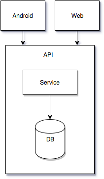

# appsclub.hire.me

THE WORLD’S LEADING APPS SUBSCRIPTION SERVICE

## Aí você teve uma ideia...

Imagine que você conseguiu: 

* uma parceria com os principais desenvolvedores de apps Android do mundo. 
* uma parceria com as grandes operadoras de telefonia do planeta.
* milhões de assinantes dispostos a pagar uma assinatura para utilizar um monte de apps bacanas.

Com isso, você decide criar o Apps Club: um serviço de assinatura, onde o usuário paga um pequeno valor recorrente para utilizar centenas de apps que, se comprados individualmente, custariam milhares e milhares de reais. O assinante paga o valor direto na conta de telefone da operadora, sem precisar de cartão de crédito.

Acho que você teve uma boa ideia, hein? =)

## Mãos à obra

Ok, deu pra ver que você é fera nos negócios, mas chegou a hora de programar! Eis uma visão geral da arquitetura que precisaremos desenvolver:

Serão várias aplicações-cliente, uma por operadora, acessando uma API que lista os apps disponíveis para download.

Simples assim? Quase... 

Aí vão algumas considerações:

* Desenvolvedores podem já possuir contratos de exclusividade com outros distribuidores em determinados países, portanto, nem todos os apps vão estar disponíveis em todos os territórios.
* Você decidiu separar o conteúdo em 3 ofertas diferentes para atrair públicos distintos, como crianças ou viciados em games. Logo, o cliente de uma operadora pode escolher entre 3 pacotes de apps independentes: apps, games ou kids.
* As aplicação-cliente das operadoras devem ser totalmente isoladas entre si e personificar uma oferta (apps/games/kids) dentro de uma operadora.

## Para backend developers

Você não precisa criar uma aplicação-cliente para a sua API, mas ela deve ser capaz de identificar quem está solicitando o conteúdo e responder de maneira adequada para cada solicitante.

O paradigma de banco de dados fica a seu gosto: SQL ou NoSQL. A linguagem de programação também (Java, Python, NodeJs, etc), desde que o resultado final seja um boa API.

## Para Android developers

A boa notícia é que você não precisa criar o backend do zero. Estaremos de olho apenas no seu código Android, então fique à vontade para utilizar um serviço de mock de API (como o [Apiary] (https://apiary.io/), por exemplo) para simular seu backend.

A notícia nem tão boa é que seu projeto **deve** gerar, pelo menos, duas instâncias do nosso produto. Exemplo: operadora1-kids.apk, operadora2-games.apk

Ao abrir o app, o usuário deve visualizar uma listagem com os apps disponíveis para download. Ao clicar num item da listagem, o usuário deve visualizar a tela de detalhes do app em questão. Tudo, é claro, seguindo os princípios do Material Design. Mas isso nem precisava dizer, né? =)

## Para fullstack developers

Vai fazer tudão? Sério? Posso te seguir no Face?

